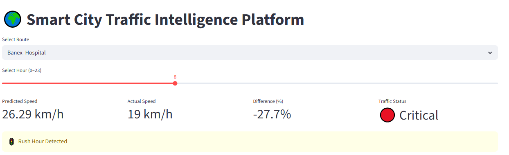
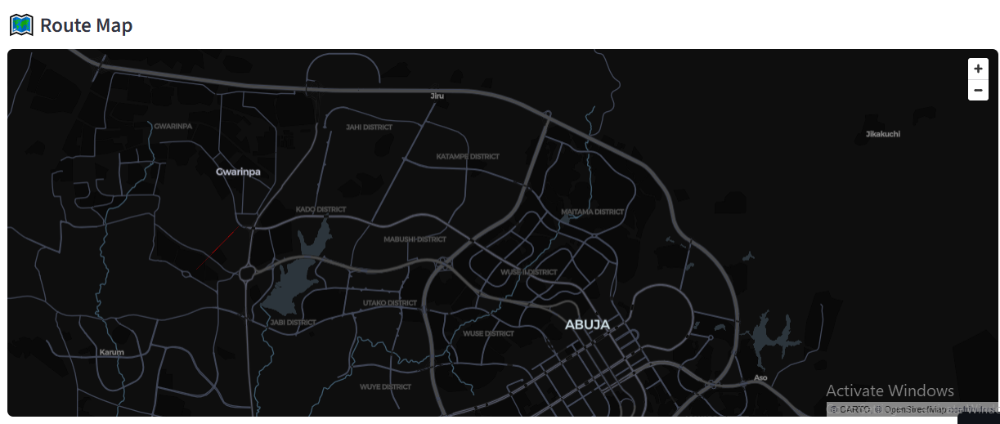
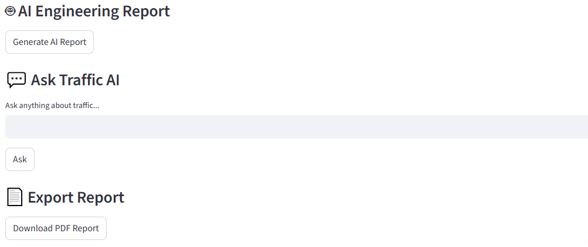

# 🌍 Smart City Traffic Intelligence Platform

An AI-powered smart traffic management dashboard built with **Streamlit**, **Machine Learning**, **OpenAI GPT**, and **Interactive Maps** to analyze traffic congestion, predict speed patterns, generate engineering reports, and support smart city transportation planning.

🔗 **Live App:** https://olonisakin.streamlit.app/

---

## 📌 Project Overview

Urban traffic congestion remains one of the biggest challenges in growing cities. This project provides an intelligent solution for monitoring and analyzing traffic movement using predictive analytics and AI-generated recommendations.

The platform simulates a **Smart City Traffic Intelligence System** capable of:

- Predicting route traffic speed
- Detecting congestion severity
- Visualizing traffic routes on maps
- Simulating live traffic feeds
- Generating AI engineering reports
- Exporting traffic reports as PDF
- Allowing users to ask an AI Traffic Assistant

---

## 🚀 Features

### 📊 Traffic Dashboard
Displays key metrics such as:

- Predicted Speed
- Actual Speed
- Percentage Difference
- Traffic Status Level

### 🤖 Machine Learning Prediction

Uses **Random Forest Regressor** to predict route traffic speed based on:

- Route Length
- Travel Time
- Hour of Day

### 🚦 Congestion Detection

Traffic severity is automatically classified as:

- 🟢 Normal
- 🟡 Moderate
- 🟠 Heavy
- 🔴 Critical

### 🗺️ Smart Route Map

Interactive route visualization using **PyDeck**.

### 📡 Live Traffic Feed

Simulated live traffic monitoring system displaying:

- Traffic Level
- Average Speed
- Incident Alerts

### 🤖 AI Engineering Report

Uses **OpenAI GPT-4o-mini** to generate professional traffic engineering analysis including:

- Root Cause
- Impact
- Recommended Solutions

### 💬 Ask Traffic AI

Users can ask custom traffic-related questions.

### 📄 PDF Export

Download route traffic reports instantly as PDF.

---

## 🖼️ App Screenshots

### Dashboard



### Route Map



### Live Traffic Feed


### AI Report



---

## 🛠️ Tech Stack

- **Python**
- **Streamlit**
- **Pandas**
- **NumPy**
- **Scikit-learn**
- **PyDeck**
- **OpenAI API**
- **FPDF**

---

## 📂 Project Structure

```bash
Smart-City-Traffic-Intelligence-Platform/
│── assets/
│   ├── AI.png
│   ├── Dashboard.png
│   ├── Map.png
│   └── Traffic Feed.png
│── dad4.py
│── requirements.txt

```
---
⚙️ Installation & Setup
1️⃣ Clone Repository

```bash
git clone https://github.com/yourusername/Smart-City-Traffic-Intelligence-Platform.git
cd Smart-City-Traffic-Intelligence-Platform
```
---
2️⃣ Install Dependencies

```bash
pip install -r requirements.txt
```
---
3️⃣ Add OpenAI API Key

Create
```bash
.streamlit/secrets.toml
```
---
Add:
```bash
OPENAI_API_KEY="your_api_key_here"
```
---
OPENAI_API_KEY="your_api_key_here"
```
---
4️⃣ Run App
```bash
streamlit run dad4.py
```
---
## 📌 Use Cases

- Smart Mobility Systems  
- Urban Transport Planning  
- AI Decision Support  
- Public Transport Optimization  
- Traffic Policy Simulation  
- Sustainable Transportation Research  

## 📈 Future Improvements

- Real-time Traffic API Integration  
- Route Recommendation System  
- Fare Prediction Engine  
- GPS Tracking Integration  
- Public Transport Demand Forecasting  
- Power BI Dashboard Version  

## 👨‍💻 Author

**Kolade Olonisakin**  
Data Scientist | Machine Learning Engineer | AI Enthusiast  

## ⭐ Support

If you like this project, kindly **star the repository** and share.
